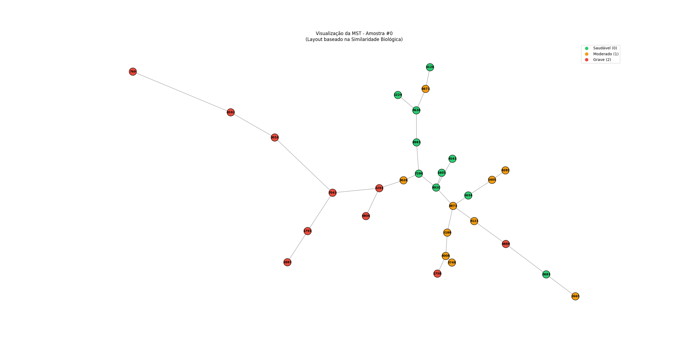
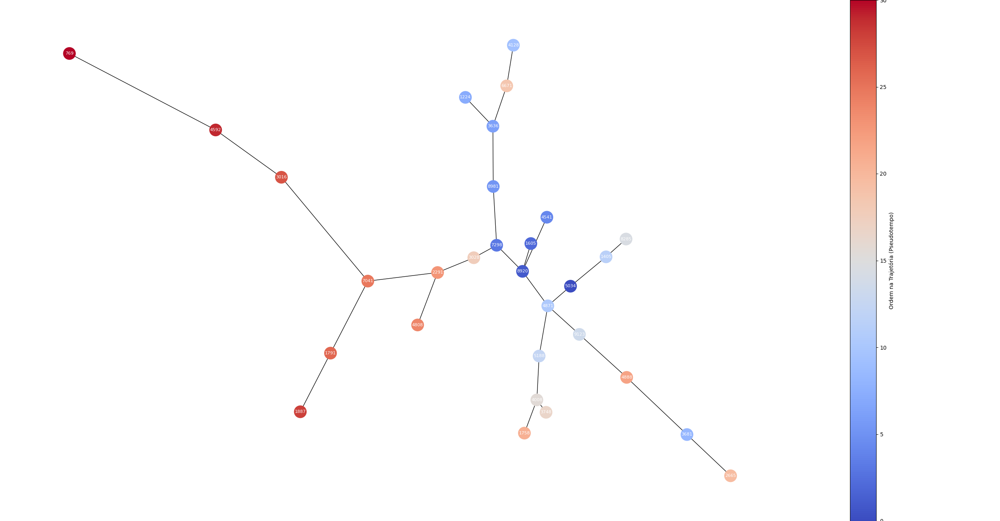
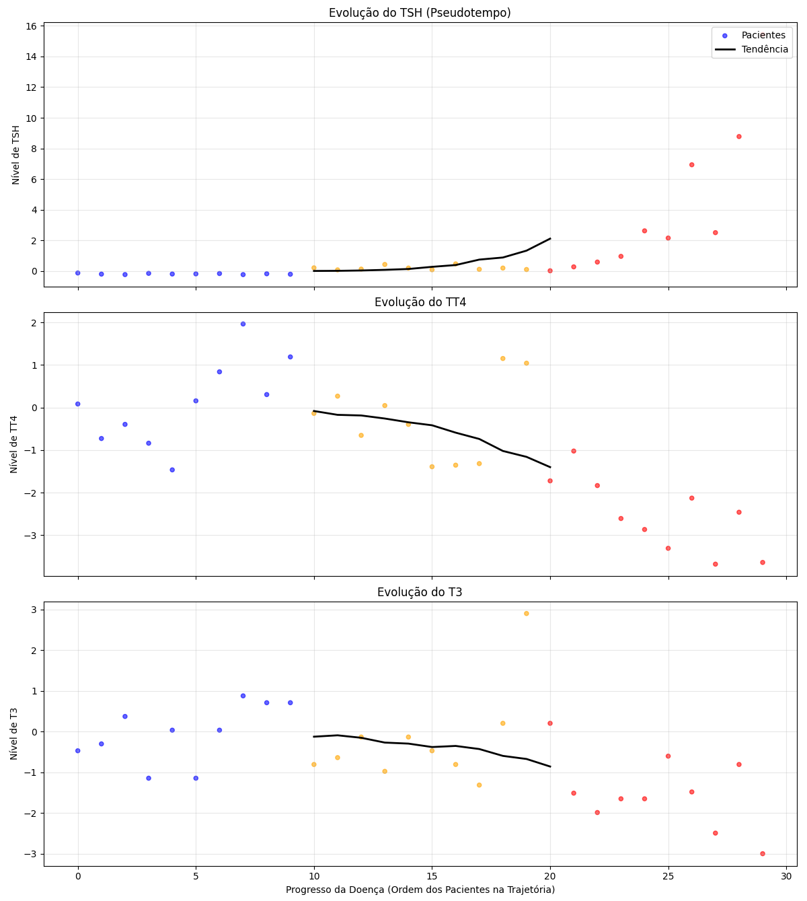

# 🧬 Thyroid Disease Trajectory: Constructing Pseudo-Time Series from Static Clinical Data


## 📖 Overview
**How do you map the temporal evolution of a disease using only static snapshots?**

This project implements a **Trajectory Inference** pipeline designed to construct **Pseudo-Time Series** from static **cross-sectional databases**.

Traditional cross-sectional studies provide only a snapshot of disease processes, lacking the temporal dimension required for prognostic modeling. To bridge this gap, we apply **Euclidean Distance** and **Graph Theory (Minimum Spanning Tree)** to reconstruct the latent temporal structure of Hypothyroidism.

By mathematically ordering patients along an inferred **"Pseudo-Time" axis**, we transform static hormonal profiles (TSH, T3, T4, FTI, T4U) into a continuous longitudinal timeline. This allows for the analysis of disease transition states and progression dynamics without the prohibitive cost and time constraints of collecting true longitudinal data.

---

## 🎯 The Core Problem: The "Longitudinal Gap"
In healthcare analytics, understanding *how* a patient transitions from "Healthy" to "Severe" is crucial. However, true **Longitudinal Data** (tracking the same patient over years) is:
* Rare and expensive.
* Often unavailable for large populations.

Most available datasets are **Cross-Sectional** (snapshots of many different patients at a single point in time). Traditional Machine Learning classifiers can label these patients, but they cannot tell the story of *progression*.

### 💡 The Solution
We model the N-dimensional feature space by computing Euclidean Distances to build a Minimum Spanning Tree (MST) structure. By defining a "Healthy" reference point as the root, we calculate the cumulative path distance along the tree to every other patient. This allows us to mathematically infer their temporal ordering and reconstruct the disease trajectory.

---

## 🔬 Methodology & Architecture

The pipeline is modularized into four distinct stages:

### 1. Data Embedding & Space Construction
* **Input:** Raw clinical data sourced from Kaggle ([Thyroid Disease Data](https://www.kaggle.com/datasets/emmanuelfwerr/thyroid-disease-data)). 
* **Process:** Outlier removal, cleaning, and Z-Score normalization of hormonal features (TSH, T3, TT4, T4U, FTI, Age).
* **Goal:** Preprocess and standardize raw data to ensure the dataset is clean, consistent, and ready for computational modeling.
> **Note on Exclusion Criteria (Secondary Hypothyroidism):** We explicitly excluded cases of secondary hypothyroidism.
> * **Clinical Rationale:** Unlike primary thyroid disease, this condition stems from pituitary (hypophyseal) dysfunction, causing TSH levels to drop below normal range despite the thyroid gland itself being structurally healthy.
> * **Impact on Modeling:** Including these cases would introduce significant **label noise**, as their biochemical signature (Low TSH) contradicts the standard trajectory of primary thyroid failure (typically associated with rising TSH), potentially confounding the pseudo-time inference algorithm.

### 2. Stratified Subsampling
* To validate the stability of the inferred trajectory, we implemented a **Hybrid Monte Carlo Subsampling** strategy ($k=1500$ iterations).
* **Trajectory Standardization ($T=30$):** We fixed the sample size to 30 to standardize the extent of the generated graphs and trajectories. This ensures that all iterations possess the same topological length, allowing for direct and consistent statistical comparison.
* **Full Spectrum Coverage (Addressing Imbalance):** Our dataset exhibits a significant **class imbalance** typical of medical cohorts (~6,700 Healthy controls vs. ~600 Pathological cases).
    * **The Challenge:** Given this distribution, standard random sampling would probabilistically yield subsets saturated with healthy individuals, effectively "cutting off" the later stages of the disease.
    * **The Solution:** To prevent these **biologically truncated trajectories**, we enforce **stochastic quotas**. This guarantees that every subsample ($T=30$) includes representatives from all stages, regardless of their rarity in the global pool:
        * **Severe ($n \in [1, 10]$):** Guarantees that the trajectory always reaches the disease endpoint, testing resilience in both sparse (single-case) and dense scenarios.
        * **Moderate ($n \in [5, 10]$) & Healthy ($n \in [1, 4]$):** Ensures a stable "root" and the transitional bridge between health and disease.
* **Natural Density:** The remaining slots ($T - \sum selected$) are filled by randomly sampling from the **entire dataset**.

> **Note on Sampling Strategy:** The specific quota parameters (e.g., 1-10 severe cases) were empirically tuned to guarantee manifold connectivity for this specific cohort. Further investigation into adaptive density estimation or alternative filling strategies could refine this step, potentially reducing the need for manual constraint tuning in future applications.

### 3. Topological Modeling (Euclidean Matrix and MST)
* **Algorithm:** We compute a euclidean distance matrix and build a **Minimum Spanning Tree (MST)**.
* **Why MST?** It connects all patients with the minimum possible total edge weight, revealing the "skeleton" of the data structure and filtering out noise/weak connections.

### 4. Pseudo-Time Inference & Biological Constraints
To transform the static MST structure into a dynamic timeline (Pseudo-Time), we apply a three-step pipeline for each of the $k$ bootstrap samples:

#### 4.1. Root Definition (Robust Healthy Centroid)
To define the onset of the disease ($t=0$), we avoid selecting a random healthy patient, which could introduce noise (e.g., an outlier on the cluster edge).
* **Method:** We calculate the "ideal center" (vector mean) of all Healthy subjects (`Label=0`).
* **Selection:** The actual patient geometrically closest to this mean is selected as the **Root Node**. This ensures the trajectory starts from the most representative baseline of health.

#### 4.2. Path Distance Calculation (Dijkstra vs. Floyd-Warshall)
We calculate the **cumulative path distance** along the MST edges from the Root to every other patient.
* **Algorithm:** We utilize **Dijkstra's Algorithm**.
* **Efficiency:** Since we only require distances from a single source (Root) to all other nodes (*One-to-All*), Dijkstra is significantly more computationally efficient than Floyd-Warshall (*All-Pairs*, $O(V^3)$). Given the high number of bootstrap iterations ($k=1500$), this optimization is essential for performance.

#### 4.3. Monotonicity Constraint (Biological Locking)
To construct the final trajectory, patients are ordered based on a priority tuple: `(Severity Class, Path Distance)`.
* **The Logic:** By sorting primarily by clinical stage ($0 \to 1 \to 2$) and secondarily by the calculated distance, we enforce a **strict biological progression**.
* **Preventing Unreal Reversals:** This constraint mathematically prevents "zig-zag" trajectories (e.g., *Healthy $\to$ Severe $\to$ Moderate*). In this model, a patient cannot advance in pseudo-time while regressing in clinical severity.
* **Justification:** As discussed by *Tucker et al. (2017)*, while real-world patients may recover or respond to treatment, the objective of this model is to map the **Natural History of Disease Progression**. Therefore, we model the physiological degradation as a monotonic process, ensuring the trajectory strictly follows the path from Health to Severe Disease.

### 5. Results: Generation of Pseudo-Time Series (PTS)
The topological ordering derived from the proposed pipeline transforms the static cross-sectional data into dynamic **Pseudo-Time Series (PTS)**.
* **Interpretation of Pseudo-Time:** The calculated distance from the healthy root ($t=0$) serves as a latent variable representing the **Disease Evolutionary Stage**. Effectively, this acts as a continuous **Severity Index**, mapping patients from "Normative Health" through "Transition" to "Severe Pathology".
* **Data Export:** The final compilation of these $k=1500$ trajectories is exported to a CSV file (`trajectories_output.csv`). This dataset serves as the foundational input for subsequent temporal analysis (e.g., LSTM modeling or phenotypic clustering).

---

## 📊 Visual Analysis

### The Manifold Topology (MST)

* > **Figure 1:** **Minimum Spanning Tree (MST) Visualization (Representative Sample).** This graph illustrates the topological structure of disease progression derived from a single bootstrap subsample ($T=30$) after Euclidean distance calculation. The **edge lengths** are proportional to the biological dissimilarity between patients (longer edges indicate greater variation in hormone profiles). The node colors represent the clinical ground truth: **Green (Healthy)**, **Orange (Moderate)**, and **Red (Severe)**. Note the natural formation of a gradient, where healthy nodes cluster together and transition into moderate and severe states, validating the biological continuum hypothesis.*

### Pseudo-Time Trajectory Ordering

* > **Figure 2:** **Pseudo-Time Trajectory with Monotonicity Constraints (Same Sample).** This visualization applies **Dijkstra's algorithm** to the MST shown in Figure 1, ordering the nodes based on **severity grades** and **cumulative distances**. The **Color Gradient** (sidebar) represents the resulting **Pseudo-Time Order** (from $t=0$ to $t=30$), transitioning from **Dark Blue (Start/Healthy)** to **Dark Orange/Red (End/Severe)**.*
> * **Correction of Unreal Trajectories:** Note that the coloring enforces a strict unidirectional flow. Even if a "Moderate" patient is topologically close to a "Healthy" cluster due to individual variability, the ordering logic forces their pseudo-time to occur *after* the healthy stage. This effectively prevents biologically impossible "zig-zag" patterns (e.g., Healthy $\to$ Moderate $\to$ Healthy).

### The "Trajectory Beam" (Stability Analysis)
This visualization validates the robustness of the inferred timeline.

* > **Figure 3:** **Reconstructed Disease Trajectory (Example Visualization).** The **X-axis** represents the inferred **Pseudo-Time** (evolutionary stage), while the **Y-axis** corresponds to the normalized **Hormone Levels** (TSH, T3, TT4). The **solid black line** depicts the evolutionary trend of the disease within a single generated trajectory after the full pipeline processing. Scatter points represent individual patients, color-coded by clinical severity: **Blue (Healthy)**, **Yellow (Moderate)**, and **Red (Severe)**. The plots highlight the inverse relationship characterized by a sharp rise in **TSH** coupled with a progressive decline in **T3 and TT4** levels.*

---

## 📂 Project Structure

The codebase is organized as a scalable Python package:

```text
thyroid-trajectory/
├── data/
│   ├── raw/                # Original dataset 
│   ├── processed/          # Cleaned data
│   ├── results             # Final CSV outputs (with patient trajectories) 
|
├── figures/                # Generated plots 
│
├── src/                    # Source Code Package
│   ├── __init__.py         # Package initialization
│   ├── preprocessing.py    # ETL, Imputation & Normalization
│   ├── euclidean_matrix.py # Distance Matrix Computation
│   ├── mst.py              # Graph Topology & Tree Construction
│   ├── trajectory.py       # Pathfinding (Dijkstra) & Sorting Logic
│   └── bootstrap.py        # Data Resampling Logic
│
├── main.py                 # Main execution pipeline
├── requirements.txt        # Project dependencies
└── README.md               # Documentation
```

---

## 🚀 How to Run
To replicate the analysis and generate the pseudo-time trajectories:
1.  **Clone the repository:**
    ```bash
    git clone [https://github.com/KarinyxD/Pseudo-Time-Series-Thyroid-Diseases.git](https://github.com/seu-usuario/thyroid-trajectory.git)
    cd Pseudo-Time-Series-Thyroid-Diseases 
    ```

2.  **Install dependencies:**
    Ensure you have Python 3.8+ installed. Then run:
    ```bash
    pip install -r requirements.txt
    ```

3.  **Run the Inference Pipeline:**
    Execute the main script to process data, run the bootstrap, and export results:
    ```bash
    python main.py
    ```

### Output
The script will generate a CSV file in `data/results/trajectories.csv` containing:
* **Original Clinical Values:** (TSH, T3, TT4, T4U, FTI, Age).
* **Inferred Pseudo-Time:** The calculated disease progression score.
* **Bootstrap Metadata:** Tracking of stability across the 50 simulation rounds.

---

## 👤 Author

**Kariny Abrahão**

*Computer Scientist*

## 📚 Referências

1.  **Tucker, A., Li, Y., & Garway-Heath, D.** (2017). Updating Markov models to integrate cross-sectional and longitudinal studies. *Artificial Intelligence in Medicine*, 77, 23–30.
    * [DOI: 10.1016/j.artmed.2017.03.005](https://doi.org/10.1016/j.artmed.2017.03.005)

2.  **Puccio, B., Tucker, A., & Veltri, P.** (2024). Clustering Pseudo Time Series: Exploring Trajectories in the Ageing Process. In *pHealth 2024 Proceedings* (Studies in Health Technology and Informatics, Vol. 314, pp. 118–119). IOS Press.
    * [DOI: 10.3233/SHTI240070](https://doi.org/10.3233/SHTI240070)

## 📝 License
This project is licensed under the MIT License - see the [LICENSE](LICENSE) file for details.